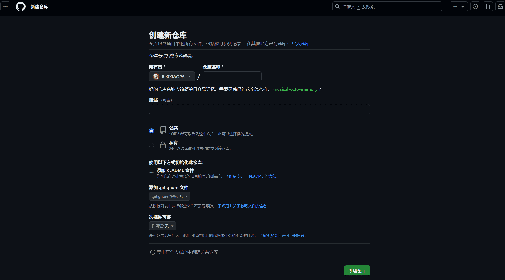

# Git 上传GitHub仓库使用

## 创建一个空仓库



## 准备工作
```sh
git config --global user.name "user-attachments" 

git config --global user.email "user-attachments@qq.com"

git init

git add . git commit -m "first commit"

git remote add origin https://github.com/user-attachments/git-code.git
```
## 添加远程仓库
```sh
git remote add origin https://github.com/user-attachments/git-code.git git push -u origin master
```
## 提交代码
```sh
git add . git commit -m "first commit" git push -u origin master
```

## 修改代码
```sh
git add . git commit -m "modify code" git push -u origin master
```

## 删除远程仓库
```sh
git remote rm origin git remote add origin https://github.com/user-attachments/git-code.git git push -u origin master
```

## 删除本地仓库
```sh
git remote rm origin git remote add origin https://github.com/user-attachments/git-code.git git push -u origin master
```

## .gitignore 忽略文件
```sh
.idea/ .vscode/ .gitignore .DS_Store node_modules/ dist/
```

## 部分命令
```sh
**查看远程仓库**
git remote -v


**添加远程仓库**
git remote add origin https://github.com/user-attachments/git-code.git


**推送到远程仓库**
git push -u origin master


**推送到远程仓库并创建分支**
git push -u origin master --force-with-lease


**检查远程仓库的状态**
使用 `git fetch` 来获取远程仓库的最新状态，但不会自动合并到你的当前分支。
git fetch origin


**强制推送**
如果你确定你的更改不会覆盖远程仓库上其他人的工作，并且你想要强制推送你的更改，
可以使用 `--force` 或 `--force-with-lease` 选项。注意：强制推送可能会覆盖远程仓库上的
更改，这可能会影响其他协作者的工作。
git push -u origin master --force


**或者更安全的方式**
git push -u origin master --force-with-lease


注意这里使用了单个反引号 () 包围命令，而不是三个反引号 ``` 开始和结束。如果你确实需要在 VitePress 中使用三个反引号来表示代码块，你应该使用正确的语法高亮标记，例如 ````sh 或 bash` 来指定 shell 脚本语言，或者 markdown` 来指定 Markdown 语言。例如：

markdown

git config --global user.name "user-attachments"
git config --global user.email "user-attachments@qq.com"

```

## 此页使用教程(我自己看的)
```sh
git remote add origin 仓库地址 
git remote add origin https://github.com/user-attachments/git-code.git
```